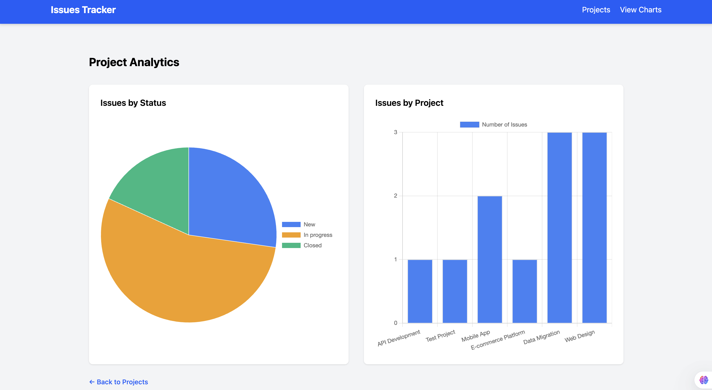
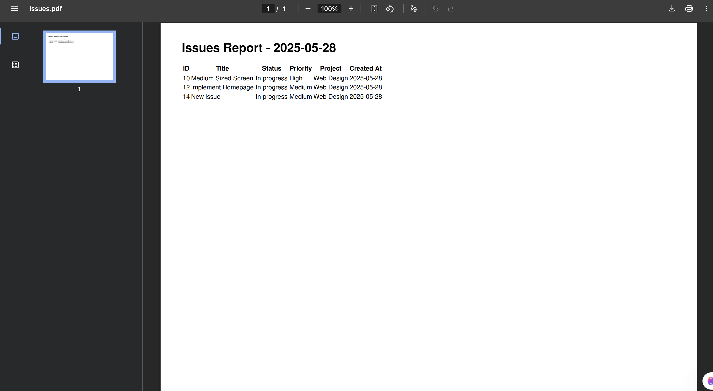
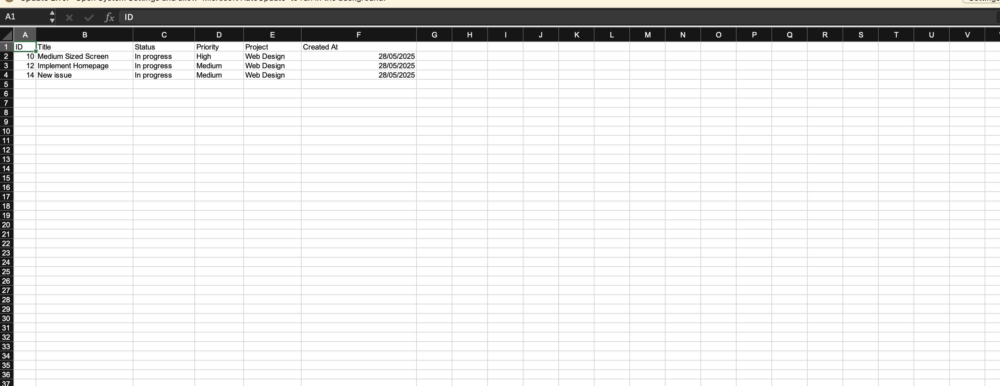

# Issue Tracker

This is a **Rails-based Issue Tracking Application** that allows users to create, manage, and analyze issues across multiple projects. The app supports exporting issue reports in **Excel and PDF formats**, viewing analytics via charts (Chart.js), that filters issues by status and project.

## 🛠 What the App Does

* Create and manage multiple **Projects**
* Add, edit, delete **Issues** under each project
* Track issue **status** and **priority**
* Export issues per project in **Excel (`.xlsx`)** and **PDF** formats
* View **analytics charts** (Issues by Status & Issues by Project)
* Clean UI with **TailwindCSS** styling

---

## 💎 Ruby Version

```bash
ruby 3.2.2
```

---

## 📦 System Dependencies

* Rails 7+
* PostgreSQL / SQLite (depending on your environment)
* Node.js & Yarn (for JS asset management)
* TailwindCSS (via Rails)
* Chart.js (for visualizations)
* `cxlsx_rails` gem (for Excel export)
* `wicked_pdf` and `wkhtmltopdf` (for PDF export)

---

## ⚙️ Configuration

1. Clone the repo:

   ```bash
   git clone https://github.com/kwambiee/issue-tracker.git
   cd issue-tracker
   ```

2. Install dependencies:

   ```bash
   bundle install
   yarn install
   ```

3. Set up your environment file (optional for secrets):

   ```bash
   cp .env.example .env
   ```

---

## 🗄 Database Creation

```bash
rails db:create
```

---

## 🔧 Database Initialization

```bash
rails db:migrate
rails db:seed
```

Seeds will populate sample projects and issues for testing.

---

## ✅ How to Run the Test Suite

(If tests are implemented)

```bash
bundle exec rspec
```

Or with built-in Rails test framework:

```bash
rails test
```

---

## 🚀 How to Run the App

Start the Rails server:

```bash
rails server
```

Then visit:

```
http://localhost:3000
```

---

## 🌍 Deployment Instructions

You can deploy this app using platforms like **Render**, **Heroku**, or **Railway**. Basic steps:

1. Push to GitHub
2. Connect to the platform of your choice
3. Ensure `wkhtmltopdf` is installed on the production server for PDF export

---

## Deployed Link
[Issue Tracker Live](https://issues-tracker-cuo8.onrender.com/)

---

## 🎥 Video Demonstration

Watch a walkthrough of the app here:
[Issue Tracker Demo](https://www.loom.com/share/c6084d2915df4137ac333e5e05b6cca6?sid=b11d2b5d-9e99-42f9-9b15-8dabe1b693fc)

---

## 📸 Screenshots
### Charts 



### PDF Report 


### Excel Report 


## 📄 License

This project is licensed under the [MIT License](LICENSE).

---

## 👩‍💻 Author

**Kwamboka Joy (kwambiee)**

GitHub: [kwambiee](https://github.com/kwambiee)
LinkedIn: [Kwamboka Joy](https://www.linkedin.com/in/kwamboka-joy/)
Email: [kwambokaj2.jk@gmail.com](mailto:kwambokaj2.jk@gmail.com)

---
